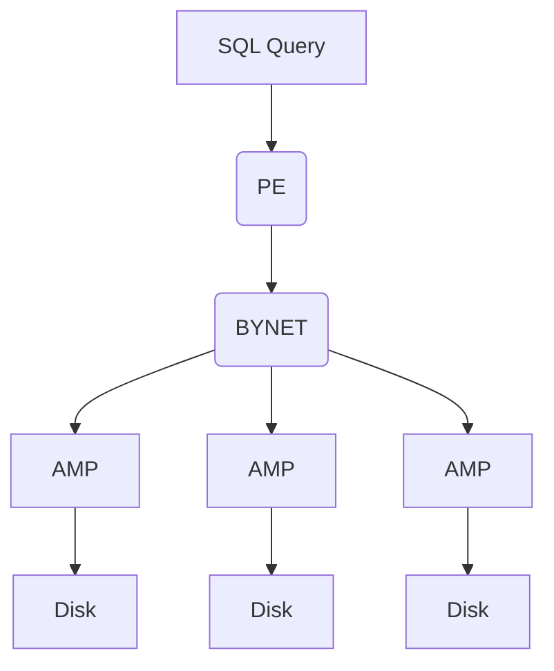

### Teradata Architecture
> - PE - Parsing Engine
> - AMP - Access Module Processor

##### Parsing Engine
- **Parser**: The Parser checks for the syntax, if true forward the query to Session Handler.
- **Session Handler**: it does all the security checks, such as checking of logging credentials and whether the user has permission to execute the query or not.
- **Optimizer**: It finds out the best possible and optimized plan to execute the query.
- **Dispatcher**: The Dispatcher forwards the query to the AMPs. 

##### BYNET
acts as a channel between PE and AMPs. There are 2 BYNETs: BYNET 0 and BYNET 1. Reasons are:
- failover
- scalability( when data is large)

##### AMP
- Shared nothing architecture
- execution steps：
    1. lock the table
    2. execute the query
    3. end the transaction

##### How does query work

> - AWT do the sort, aggregate, redistribute the data
> - BYNET will merge all the result and prepare the final result and pass it to dispatcher
> - Dispatcher package the result into **response parcel** and dispatch it to the GATEWAY

